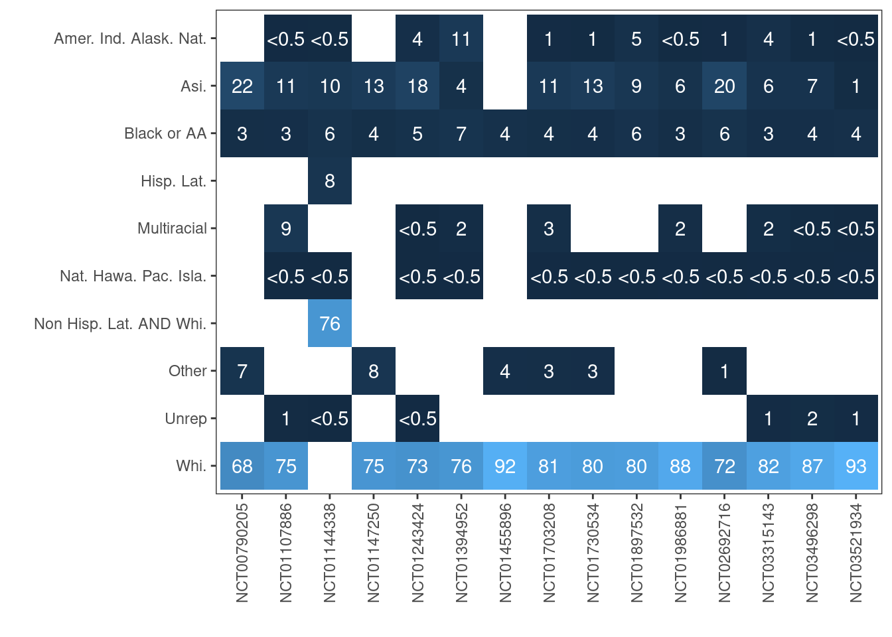

::: {.cell}

:::

::: {.cell}

:::


# Introduction

We have published a [pre-print examing heterogeneity of treatment effects (HTE) by age and sex](https://www.medrxiv.org/content/10.1101/2024.06.23.24309242v1) for novel antidiabetics (SGLT-2 inhibitors, GLP-1 analogues and DPP-4 inhibitors) for two outcomes i) HbA1c and ii) MACE. The pre-print included 75 IPD trials (6 MACE, 74 HbA1c). We subsequently revised the manuscript and in doing so added new HbA1c trials, taking the total to 103. 

This document specifies the next analysis which will extend the previous work by i) modelling additional treatment-covariate interactions using the aggregate and IPD trials and ii) using the output of these models to *calibrate* the efficacy estimates to the Scottish population. 

This analysis plan is being posted after conducting data harmonisation and some analysis of the baseline covariates (eg plots and summaries of distributions)  but **before** linking the outcome data to the covariate data. The exception to this is age, sex and HbA1c at baseline, which was already been linked to the outcome data for the earlier analysis.

**Note also that the data in this document are only partially cleaned and the exact numbers of trials with data for different covariates will differ in the final paper. These counts, however, give an indication of the levels of data availability for each variable.**

# Overall design {#sec-overall}

Briefly the overall analysis will comprise:-

1.  For trials where we have IPD, fitting trial-level models to each trial (hereafter termed trial-level models)
2.  For trials were we do not have IPD, (hereafter termed aggregate-level data)
    a)  obtaining trial-level effect estimates and
    b)  obtaining summary covariate data
3.  Obtaining estimates of the correlations between covariates using trial IPD
4.  Fitting multi-level network meta-regression (ML-NMR) models using data from 1-3 within the R multinma package
5.  Obtaining covariates for individuals in the Scottish Diabetes Register in whom all of the three novel drug classes could be considered
6.  Combining the outputs of (4) and (5) to obtain *calibrated* treatment efficacy estimates

Notes on the above:-

-   For MACE trials, where this is available, we will also include subgroup-level data as a form of aggregate-level data (see point 2a). We will include sex subgroup data in the main analysis, and subgroup-level data for other covariates in sensitivity analyses.
-   In the previous analysis the trial IPD was spread across multiple Vivli repositories which could only be accessed separately. This was a major motivation for this two-stage approach (ie to fitting trial-level models as stage one then using the outputs of these as inputs to ML-NMR models as stage two), rather than fitting a single model with aggregate-level trial data and trial IPD included directly in the ML-NMR model. Now, all of the IPD is held within a single repository. Despite this change we propose to continue the use of a two-stage analysis because:-
    -   within the repository, we have been unable to successfully use the multinma package even for minimal examples. In contrast multinma is very easy to run on a local machine/university high-performance computing cluster
    -   we would not be able to export the ML-NMR model objects from the repository, and are unsure whether we would even be able to export samples from the posterior. Also, the target population data cannot be uploaded to the Vivli repository. Thus it would be challenging to perform the calibration step if we were to choose a single-stage approach.
    -   the aggregate-level trial data is not held within the repository
    -   the two-stage approach allows for more open research, with greater transparency and reuse of trial data than does a single-stage approach

In this document, the register variables and trial baseline characteristics (eg age, sex, duration of diabetes) are referred to as covariates throughout regardless of the source from which they were obtained.

# Existing choices made in the age-sex HTE paper

In developing and undertaking the analysis for the age-sex HTE paper we made a number of analysis decisions including:-

-   setting which trials should be be excluded from the final analysis
-   stratification of the HbA1c analysis into mono, dual and triple therapy trials for HbA1c and MACE (although the MACE trials were all included in the same analysis)
-   arm exclusions (eg arms with combination therapies were excluded)
-   collapsing of information concerning drug classes/drugs/doses - eg individual doses were modelled separately for the three novel drugs of interest, but collapsed to drug-level for other classes, except insulins which were collapsed to class level
-   methods for collapsing/aggregation of arms
-   inclusion of subgroup-level estimates for MACE trials - this was included for sex in the main analysis. Only one covariate at a time can be included as a subgroup-level estimate in the current version of the ML-NMR package
-   choice of statistical distributions for age (ie truncated normal) and HbA1c at baseline (normal)
-   method for estimating parameters of distributions for representing continuous variables where a different summary statistic was provided
-   number of integration points in analysis of aggregate data (one - ie the mean for HbA1c and derived via the multinma algorithm for MACE)
-   For aggregate-level trials, if the outcome was not reported these were excluded
-   selecting linear models for HbA1c and Cox models for MACE for the trial-level models
-   selecting regression outputs for the IPD and arm-level data in preference to contrast-level data for the aggregate trials when fitting the ML-NMR models

We will retain these choices made in the HTE age-sex analysis, and any others not above mentioned but set out in the manuscript, supplementary appendix and/or [published code](https://github.com/Type2DiabetesSystematicReview/nma_agesex_public).

# Availability of aggregate-level data on baseline characteristics {#sec-covariatesproposed}

@tbl-bascov shows the frequency with which each variable was reported in published papers or on clinicaltrials.gov. This is broken down by type of trial, MACE/HbA1c (where has HbA1c and MACE shows only MACE) and whether or not we have access to IPD. 


::: {#tbl-bascov .cell tbl-cap='Proportion of trials publicly reporting results for each variable, by type of trial'}
::: {.cell-output-display}


|variable               |IPD MACE |Agg MACE  |IPD HbA1c |Agg HbA1c  |
|:----------------------|:--------|:---------|:---------|:----------|
|Age/sex (prev paper)   |6 (100%) |17 (100%) |97 (100%) |483 (100%) |
|BMI                    |6 (100%) |17 (100%) |91 (94%)  |439 (91%)  |
|Duration T2DM          |5 (83%)  |16 (94%)  |62 (64%)  |403 (83%)  |
|Metformin              |1 (17%)  |11 (65%)  |71 (73%)  |359 (74%)  |
|Race                   |6 (100%) |17 (100%) |84 (87%)  |243 (50%)  |
|Sulphonylureas         |1 (17%)  |10 (59%)  |35 (36%)  |202 (42%)  |
|Blood pressure         |5 (83%)  |14 (82%)  |28 (29%)  |188 (39%)  |
|EGFR                   |6 (100%) |17 (100%) |27 (28%)  |141 (29%)  |
|HDL                    |3 (50%)  |8 (47%)   |2 (2%)    |110 (23%)  |
|Total cholesterol      |3 (50%)  |6 (35%)   |2 (2%)    |93 (19%)   |
|Total/HDL ratio        |3 (50%)  |6 (35%)   |2 (2%)    |85 (18%)   |
|Cardiovascular disease |6 (100%) |15 (88%)  |10 (10%)  |53 (11%)   |
|Smoking status         |5 (83%)  |11 (65%)  |5 (5%)    |53 (11%)   |
|Heart failure          |6 (100%) |13 (76%)  |0 (0%)    |18 (4%)    |


:::
:::


Additional figures and tables describing the trial reporting are shown in @sec-additional.

# Availability of IPD-level data on baseline characteristics {#sec-covariatesproposedipd}

When publishing the analysis we will present heatmaps showing data availability at individual participant level for the IPD trials. In brief, for most trials, data are available for the following covariates:-
 
 - Age, sex, race, ethnicity and smoking status
 - Duration of diabetes (mixture of continuous and categorical)
 - BMI
 - Disease present at baseline
 - Concomitant medication at baseline
 - Blood pressure (systolic and diastolic)
 - Cholesterol
 - estimated glomerular filtration rate (eGFR)
 
Data is generally either missing or available for all (or almost all) participants within a trial. For the 6 MACE trials, all have age, sex, BMI, duration of diabetes, race, ethnicity, smoking, blood pressure, cholesterol and eGFR, cardiovascular disease (cerebrovascular, coronary heart disease and peripherovascular) disease.

# Main analysis {#sec-mainanalysis}

Consequent on this pattern of data availability, we will use the following limited set of covariates for the main analyses:-

-   MACE trials - Age, sex, BMI, duration of diabetes, HBA1c at baseline, race and eGFR
-   HbA1c trials - Age, sex, BMI, duration of diabetes, HBA1c at baseline

This covariate selection differs from that specified in the protocol paper, where we stated "For the main analysis, we will include the following covariates: age, duration of diabetes, HbA1c, estimated glomerular filtration rate (eGFR), total cholesterol, high-density lipoprotein cholesterol, systolic blood pressure, diastolic blood pressure, BMI, sex, ethnicity, smoking status, history of cardiovascular disease, history of heart failure, metformin use and insulin use" ([see BMJ Open paper](https://bmjopen.bmj.com/content/12/10/e066491.long)). The difference is due to a better understanding of data availability in the aggregate-level trials and of the distribution of the baseline covariates in the IPD.


::: {#tbl-macecum .cell tbl-cap='Cumulative proportion of trials with each combination of variables (ie that variable and variables higher up the table available)' tbl-subcap='["MACE trials","HbA1c trials"]'}
::: {.cell-output-display}


|variable               |IPD MACE |Agg MACE  |
|:----------------------|:--------|:---------|
|Age/sex (prev paper)   |6 (100%) |17 (100%) |
|bmi                    |6 (100%) |17 (100%) |
|race                   |6 (100%) |17 (100%) |
|egfr                   |6 (100%) |17 (100%) |
|duration_t2dm          |5 (83%)  |16 (94%)  |
|cardiovascular_disease |5 (83%)  |14 (82%)  |
|blood_pressure         |4 (67%)  |12 (71%)  |
|heart_failure          |4 (67%)  |9 (53%)   |
|metformin              |1 (17%)  |4 (24%)   |
|sulphonylureas         |1 (17%)  |4 (24%)   |
|smoking_status         |1 (17%)  |4 (24%)   |
|hdl                    |0 (0%)   |3 (18%)   |
|total_cholesterol      |0 (0%)   |3 (18%)   |
|total_hdl_ratio        |0 (0%)   |3 (18%)   |


:::

::: {.cell-output-display}


|variable               |IPD HbA1c |Agg HbA1c  |
|:----------------------|:---------|:----------|
|Age/sex (prev paper)   |97 (100%) |483 (100%) |
|bmi                    |91 (94%)  |439 (91%)  |
|duration_t2dm          |60 (62%)  |392 (81%)  |
|metformin              |45 (46%)  |299 (62%)  |
|race                   |43 (44%)  |171 (35%)  |
|sulphonylureas         |18 (19%)  |80 (17%)   |
|blood_pressure         |2 (2%)    |29 (6%)    |
|egfr                   |0 (0%)    |15 (3%)    |
|hdl                    |0 (0%)    |2 (0%)     |
|total_cholesterol      |0 (0%)    |2 (0%)     |
|total_hdl_ratio        |0 (0%)    |2 (0%)     |
|cardiovascular_disease |0 (0%)    |0 (0%)     |
|smoking_status         |0 (0%)    |0 (0%)     |
|heart_failure          |0 (0%)    |0 (0%)     |


:::
:::


We propose to include these covariates in trial-level models and ML-NMR models of HbA1c and MACE. We will include terms for both main effects and covariate-treatment interactions (except for HbA1c in the HbA1c outcome trials, where it will only be included as a main effect). We chose these variables as they are the most commonly reported for MACE and HbA1c trials respectively and the number of trials reporting all of these variables is reasonable. The high-level of reporting also reflects the perceived importance of these variables in the clinical community. Having fitted the models we will calibrate the results to the Scottish Diabetes Register (see @sec-calibration for details).

## Race/ethnicity {#sec-raceethnicity}

Race/ethnicity needs particular consideration because i) it is a multi-level categorical variable and ii) in most trials race and ethnicity were informed by the [FDA recommendations for minimal recording of ethnicity and race](https://www.fda.gov/regulatory-information/search-fda-guidance-documents/collection-race-and-ethnicity-data-clinical-trials) rather than the literature on diabetes risk and phenotypes in different population groups.

| Term                                                                                                                                                                                                         | Definition                                                                                                                                                                                                                                          |
|--------------------|----------------------------------------------------|
| Ethnicity                                                                                                                                                                                                    |                                                                                                                                                                                                                                                     |
| Hispanic or Latino                                                                                                                                                                                           | A person of Cuban, Mexican, Puerto Rican, South or Central American, or other Spanish culture or origin, regardless of race                                                                                                                         |
| Not Hispanic or Latino                                                                                                                                                                                       | Not meeting above definition                                                                                                                                                                                                                        |
| Race                                                                                                                                                                                                         |                                                                                                                                                                                                                                                     |
| American Indian or Alaska Native | A person having origins in any of the original peoples of North and South America (including Central America), and who maintains tribal affiliation or community attachment |                                                                                                                                                                                                                                                     |
| Asian                                                                                                                                                                                                        | A person having origins in any of the original peoples of the Far East, Southeast Asia, or the Indian subcontinent, including, for example, Cambodia, China, India, Japan, Korea, Malaysia, Pakistan, the Philippine Islands, Thailand, and Vietnam |
| Black or African American                                                                                                                                                                                    | A person having origins in any of the black racial groups of Africa.                                                                                                                                                                                |
| Native Hawaiian or Other Pacific Islander                                                                                                                                                                    | A person having origins in any of the original peoples of Hawaii, Guam, Samoa, or other Pacific Islands                                                                                                                                             |
| White                                                                                                                                                                                                        | A person having origins in any of the original peoples of Europe, the Middle East, or North Africa                                                                                                                                                  |

: FDA recommendations for minimal recording of ethnicity and race {#tbl-letters}

Despite this limitation, we will include race in the main analysis for MACE. We will model treatment heterogeneity according to the four commonest categories - American Indian or Alaska Native, Asian, Black or African American and White. For IPD trials, we have complete data on each of these categories (not shown here). For the aggregate-level MACE trials, we have near-complete data on these categories (@fig-racemaceplot - please note that 11% is correct for the American Indian or Alaska Native category in [NCT01394952](https://clinicaltrials.gov/study/NCT01394952), this is not a data processing error). In order to perform this proposed analysis, a number of complexities need to be addressed; among the aggregate-level trials:-

-   Six trials report an "other" category. There is no additional information in the papers as to the likely composition of this category, other than the countries in which the trial had settings (see @fig-racemaceplotcountry in @sec-additional)
-   Two trials do not have data on the American Indian or Alaska Native category but instead have 7% and 8% respectively in the "other" category. Both trials have at least one setting in the USA.
-   A third trial is also missing the Asian category; for this trial 4% are in the "other" category. This trial also has a setting in the USA
-   The decision to collapse levels for reporting is unlikely to be random. For example, it may reflect a need to reduce the risk of disclosing personal information. As such compared to trials which do not collapse the levels, trials collapsing levels may have low counts in one or more of the un-collapsed levels.
-   One trial has included Hispanic or Latino in the same denominator (rather than as an ethnicity variable as per FDA recommendations)
-   12 trials report Native Hawaiian or Other Pacific Islander, but fewer than 0.5% of participants are in this category for any trial

To include race in the model we need consistent information across trials. Therefore, to simplify this complexity we propose dropping all categories other than the four commonest (this means dropping Hispanic or Latino, Multiracial, Native Hawaiian or Pacific Islander and unreported) and by treating non-Hispanic or Latino AND White as White. We will then rescale the remaining categories so that they sum to 100%. A more complex approach based on some form of multiple imputation may be possible, but we think that this would be very difficult to implement.

For the IPD trial results we will fit trial-level models with the four commonest (American Indian or Alaska Native, Asian, Black or African American and White) as well as an "other" category which includes Native Hawaiian or Pacific Islander, multiracial, nor reported, unknown and "other". We will then drop the "other" category from the coefficients and variance-covariance matrix before running the ML-NMR models.

Some trials only include one category (eg all are Asian). For these we will fit models without race for which the remaining coefficients in the model will have the same interpretation as the remaining coefficients in trials with multiple categories, as they are still conditioned on race.

We do not propose including race/ethnicity in the main analysis for the HbA1c trials as this is less commonly reported and has greater incompleteness and complexity when it is reported (see @sec-additional).

See @sec-marginalscat for details of how this variable will be included in the modelling.


::: {.cell}
::: {.cell-output-display}
{#fig-racemaceplot width=672}
:::
:::


# Secondary analysis

In the secondary analysis we will examine covariate-treatment interactions for the remaining variables shown in Table 1, but which are not included in the main analyses. Initially, we had planned to fit these using both IPD and aggregate level data. However, given the relatively small proportion of aggregate level trials which has reported on these covariates, we will instead confine the secondary analyses to the IPD trials.

For the secondary analysis we propose the following approaches for both MACE trials and HbA1c trials:-

1.  Fit models with the main analysis variables (@sec-mainanalysis) plus each of the remaining variables (or variables calculated using these variables such as HDL/total cholesterol ratio) from @tbl-bascov, **in turn**, using a complete case approach.
2.  Fit a model including the main analysis variables and all variables found (in step 1) not to have a "weak" covariate-treatment interaction. By "weak" interactions we mean those where the ML-NMR point estimate (of the log-hazard ratio for the MACE analysis and the change in HBA1c standardised to the pre-post difference in HbA1c for the HbA1c analysis trials) lies between -0.05 and 0.05 (per standard deviation increment in the covariate for continuous variables and as absolute values for binary variables). Hence, it will only be possible to fit trial-level models for step 2 *after* fitting the ML-NMR models at step 1. Again we will use a complete case approach.
3.  Fit a minimal model including the main analysis variables and all variables found (in step 2) not to have a "weak" covariate-treatment interaction, again using a complete case approach. This last model will be calibrated to the Scottish population (see @sec-calibration).

Note that in step two we could have used the known differences between the trial and target population to indicate whether an estimated interaction-effect was likely to be large enough to matter. If the difference in distribution of a covariate between the trials and target population is small, a larger interaction would be needed to cause a difference in the average treatment effect. The converse is also true. However, we have opted not to do so in order that that the outputs of the ML-NMR models are useful across multiple settings, not just the Scottish population.

Since this variable selection approach includes examining coefficients then excluding weak associations, there is some danger of over-estimating the magnitude of the coefficients which remain. This is only an issue for secondary analysis 2 (above). If we have sufficient resource to add the ability to specify shrinkage priors using the software we are using to fit the NMA models, we will explore the use of shrinkage priors.

# IPD Trial-level models {#sec-triallvl}

As for the analysis in the previous manuscript, we will fit IPD trial level models of MACE on the treatment arm, each covariate (selected as above) and the covariate treatment interactions. For MACE we will fit Cox models and for HbA1c we will fit linear models. However, in the current analysis we will fit linear mixed models, treating time as a continuous variable. For these analysis we will re-scale time to range from 0.01 (day one) to 1 (last day as defined in the previous manuscript). For the main analysis we will treat time as linear and will include both slopes and intercepts as random effects. Only the fixed effects (with their corresponding variances/covariances) will be included in the NMA.

## Continuous variables which have been binned

For the previous paper, age and HbA1c were the only continuously distributed covariates. For the current protocol, more variables are continuously distributed. For eGFR, for all six of the MACE trials we have the raw values. However, duration of diabetes is binned for some of the IPD trials as is BMI. In order to fit models for all trials with duration data using the same parameterisation regardless of binning, we imputed values for duration of diabetes within each bin as follows.

For each binned trial - ie those where the variable (duration or BMI) was binned, we:-

1. Binned the same variable for all trials where it is provided as a continuous variable
2. Selected the trial with the most similar distribution to that binned trial (using the Chi-squared statistic)
3. Obtained the mean value within each level for that most similar trial
4. Applied the mean value to the binned trials for each level of the binned variable

This approach could be extended to allow for uncertainty by replacing steps 3 and 4 with bootstrap sampling (sampling with replacement). However, we do not think that the benefits of doing so justify the added complexity.

# Multi-level network meta regression (ML-NMR) models {#sec-mlnmr}

Using the same approach as in the HTE paper we will fit ML-NMR models using trial-level model outputs and aggregate-level effect estimates (@sec-covariatesproposed), as well as aggregate level covariate summaries (in the form of statistical distributions, see @sec-marginals) and estimates of correlations between covariates (@sec-correlations).

We will fit the ML-NMR models using:-

-   regression coefficients and covariance matrices from the trial-level models
-   covariate marginal distribution summaries (of the type reported in "Table 1" of conventional trial reports in published papers)
-   covariate correlations

For the aggregate-level data we will specify the covariate distributions as described below (@sec-marginals and @sec-correlations). After discarding the first 1000 samples, we will obtain 1000 samples from each of four chains. We will obtain point estimates and credible intervals from these samples using the same approach as we used in the the age-sex paper, that is, by taking the mean and the 2.5^th^ and 97.5^th^ centiles.

## Covariate marginal distributions  - continuous data {#sec-marginals}

Aggregate-level trial reports rarely provide information on which probabilistic distributions best fit the covariates. We analysed these distributions using the 103 IPD trials. We fitted exponential, gamma, Weibull, normal and log-normal distributions to the variable of interest for each trial in turn and used goodness of fit statistics (AICs) and visual inspection to pre-specify the following "primary" distributions for the main/secondary analyses:-

- Duration of type 2 diabetes - gamma for all trials EXCEPT ones with a mean duration of less than one year, in which case use log-normal
- BMI - log-normal distribution
- eGFR - Weibull distribution

Where aggregate-level trials do not provide the relevant parameters needed for the chosen statistical distribution (as will usually be the case) we will estimate these by numerical optimisation based on the statistics which are reported (eg means, standard deviations, quantiles - either directly or calculable from the number of participants within bins with most trials reporting means and standard deviations). This is similar to the approach we used in the previous paper. The need to perform this estimation is the reason why we confined ourselves to one or two-parameter distributions when checking the fit of different distributions to the trial IPD.

## Covariate marginal distributions  - binary {#sec-marginalsbin}

For binary variables we will assume a Bernoulli distribution.

::: {.cell}

:::


## Covariate marginal distributions  - categorical {#sec-marginalscat}

For the only categorical variable, race, we have converted each variable to a set of indicator (dummy) variables and will use separate Bernoulli distributions. This unfortunately means that, for at least some steps in the integration within the ML-NMR modelling, some notional participants are likely to be defined as simultaneously belonging to two or more mutually exclusive categories. However, we are not aware of a method which will allow us to both i) specify correlations between different variables (eg age and race) and ii) maintain the structure of a categorical variables (mutually exclusive and exhaustive levels) within the ML-NMR modelling. Therefore, we have chosen to specify the correlations (including correlations between the indicator variables and correlations between each indicator variable and other variables such as age, sex etc) and accept this as a limitation.

## Correlations between covariates {#sec-correlations}

As correlation information is rarely available from published trial reports, we obtained estimates from IPD trials and assume that these also apply to the aggregate-level data. We have obtained **rank** correlations for each pair of covariates (including the indicator variables for race) for each trial in the form of a matrix. As is the standard approach of the chosen ML-NMR software (multinma) we will subsequently calculate the weighted mean of the rank correlations to obtain a single estimate of the correlation between the covariates within trials.

We will publish the trial-level correlations between variables for each IPD trial at the time of publication. We note however that most correlations were at most moderate.

## Sub-group data {#sec-subgroup}

As per the age-sex HTE paper, for the MACE trials we will repeat the analyses, substituting in subgroup effect estimates for each covariate where this is available.

# Calibration - applying ML-NMR models to the target population {#sec-calibration}

The target population was defined in the [protocol paper](https://bmjopen.bmj.com/content/12/10/e066491.long). To this definition we add two additional constraints. First, on the basis of the trial age distribution, we will limit the target population to people aged between 40 and 85-years. Secondly, we use an existing algorithm developed for use in the Scottish Diabetes Register to exclude individuals are not currently resident in Scotland. The calibration to the target population will be performed as follows.

The true analysis will be based on 4,000 samples from the ML-NMR and around 200,000 patients from the target population. For illustration, we have used only 100 samples (and show only the first 10 samples) and only 1344 patients (and show only the first 7 patients):-

1.  A design matrix $X$ will be obtained for the target population obtained from the Scottish diabetes register (described in the protocol paper) where each column is an individual and each row a covariate (or in the case of race a set of dummy variables).


::: {.cell}
::: {.cell-output .cell-output-stdout}

```
     patient1 patient2 patient3 patient4 patient5 patient6 patient7
main        1        1        1        1        1        1        1
age        41       49       56       53       60       46       54
sex         1        0        1        0        0        1        0
bmi        27       35       24       22       24       35       21
durn        1        1        1        3        1        1        3
```


:::
:::


2.  Coefficients will be obtained from the posterior samples from the ML-NMR models in the form of a matrix, $\delta_k$, where each column represents a treatment-effect or treatment-covariate interaction effect estimate and each row is based on a separate sample from the posterior. k represents each treatment of interest compared to a reference category. The following example could be, for example, canagliflozin versus placebo.


::: {.cell}
::: {.cell-output .cell-output-stdout}

```
        main   age   sex  bmi durn
smpl1  -1.12 -0.08 -0.08 0.19 0.08
smpl2  -0.97 -0.12 -0.07 0.19 0.10
smpl3  -0.89 -0.10 -0.09 0.20 0.09
smpl4  -1.23 -0.13 -0.06 0.21 0.08
smpl5  -0.96 -0.14 -0.08 0.20 0.11
smpl6  -0.95 -0.09 -0.06 0.19 0.10
smpl7  -1.06 -0.14 -0.01 0.19 0.13
smpl8  -1.05 -0.09 -0.04 0.22 0.08
smpl9  -1.06 -0.08 -0.10 0.20 0.09
smpl10 -1.09 -0.10 -0.16 0.21 0.10
```


:::
:::


3.  We will then calculate $X\delta_k$ to obtain a matrix of linear predictors where each column shows the **difference** in HbA1c versus placebo for a single individual in the target population and each row is based on a separate sample from the posterior.


::: {.cell}
::: {.cell-output .cell-output-stdout}

```
       patient1 patient2 patient3 patient4 patient5 patient6 patient7
smpl1      0.73     1.69    -1.04    -0.94    -1.28     1.85    -1.21
smpl2     -0.73    -0.10    -3.10    -2.85    -3.51     0.19    -3.16
smpl3      0.41     1.30    -1.69    -1.52    -2.00     1.51    -1.82
smpl4     -0.87    -0.17    -3.45    -3.26    -3.91     0.16    -3.60
smpl5     -1.27    -0.71    -3.97    -3.65    -4.45    -0.37    -3.99
smpl6      0.53     1.39    -1.39    -1.24    -1.69     1.60    -1.52
smpl7     -1.55    -1.14    -4.22    -3.91    -4.77    -0.73    -4.24
smpl8      1.24     2.32    -0.77    -0.74    -1.09     2.55    -1.05
smpl9      1.05     2.11    -0.75    -0.63    -0.97     2.25    -0.91
smpl10     0.42     1.46    -1.71    -1.47    -1.95     1.60    -1.78
```


:::
:::


4.  For each sample, we will calculate the mean across patients to obtain estimates for the average treatment effect in the target population.


::: {.cell}
::: {.cell-output .cell-output-stdout}

```
 [1]  0.22 -1.58 -0.25 -1.83 -2.28 -0.05 -2.58  0.64  0.57 -0.20
```


:::
:::


5.  We will summarise 4 to obtain point estimates and credible intervals for the effect of each treatment on HbA1c *calibrated* to the target population.


::: {.cell}
::: {.cell-output .cell-output-stdout}

```
estimate      LCI      UCI 
   -0.28    -5.15     4.77 
```


:::
:::


The analysis for MACE will be similar, except that we will exponentiate results in order to produce hazard ratios.

# Additional information on baseline and trial characteristics {#sec-additional}

@fig-hmap shows the trial covariate reporting in greater detail. This figure shows that certain variables are usually reported together (eg HDL cholesterol and total cholesterol, systolic and diastolic blood pressure) and also shows which summary statistics tend to be reported for each characteristics.


::: {.cell}
::: {.cell-output-display}
{#fig-hmap width=1152}
:::
:::


@fig-mediclass shows the reporting of medications in trial baseline characteristics tables and/or clinicaltrials.gov. Of trials which report on any medications, the majority do so only for sulphonylureas and/or metformin.


::: {.cell}
::: {.cell-output-display}
{#fig-mediclass width=672}
:::
:::


@tbl-medbaseline shows the numbers and percentages for metformin, sulphonylureas and both broken down by type of trial.


::: {#tbl-medbaseline .cell tbl-cap='Metformin and sulphonylurea reporting'}
::: {.cell-output-display}


|Desig          | Trials| Metformin (n)|Metformin (%) | Any sulphonylurea (n)|Any sulphonylurea (%) | Both classes (n)|Both classes (%) |
|:--------------|------:|-------------:|:-------------|---------------------:|:---------------------|----------------:|:----------------|
|A: IPD MACE    |      6|             1|17%           |                     1|17%                   |                1|17%              |
|B: IPD HbA1c   |     69|            51|74%           |                    24|35%                   |               21|30%              |
|C: Agg MACE    |     17|             8|47%           |                     6|35%                   |                5|29%              |
|D: Agg HbA1c   |    524|           387|74%           |                   221|42%                   |              190|36%              |
|E: Weight only |     14|             0|0%            |                     0|0%                    |                0|0%               |
|Total          |    630|           447|71%           |                   252|40%                   |              217|34%              |


:::
:::


@fig-racemaceplotcountry shows which countries were included in aggregate-level MACE trials. 


::: {.cell}
::: {.cell-output-display}
{#fig-racemaceplotcountry width=672}
:::
:::

::: {.cell}
::: {.cell-output-display}
{#fig-raceethnicagg-1 width=672}
:::

::: {.cell-output-display}
{#fig-raceethnicagg-2 width=672}
:::

::: {.cell-output-display}
{#fig-raceethnicagg-3 width=672}
:::
:::

::: {#fig-smoking .cell}
::: {.cell-output-display}
{#fig-smoking-1 width=672}
:::

::: {.cell-output-display}
{#fig-smoking-2 width=672}
:::

Smoking reporting
:::


@fig-subregion and @tbl-subregion show trials with at least one setting by ISO3 sub-regions. In the latter [two-letter country codes are also shown](https://en.wikipedia.org/wiki/ISO_3166-1_alpha-2) shown.


::: {.cell}
::: {.cell-output-display}
{#fig-subregion width=672}
:::
:::

::: {#tbl-subregion .cell tbl-cap='Summary of of trials with settings in each sub-region.'}
::: {.cell-output-display}


|Region   |Sub-region                      |Country abbreviation                      | Trials|
|:--------|:-------------------------------|:-----------------------------------------|------:|
|Africa   |Northern Africa                 |DZ,EG,MA,TN                               |     16|
|Africa   |Sub-Saharan Africa              |ZA                                        |     77|
|Americas |Latin America and the Caribbean |AR,BR,CL,CO,CR,DO,EC,GT,MX,PA,PE,PR,SV,VE |    173|
|Americas |Northern America                |CA,US                                     |    243|
|Asia     |Eastern Asia                    |CN,HK,JP,KR,TW                            |    231|
|Asia     |South-eastern Asia              |ID,MY,PH,SG,TH,VN                         |     72|
|Asia     |Southern Asia                   |BD,IN,IR,LK,PK                            |    105|
|Asia     |Western Asia                    |AE,GE,IL,KW,LB,TR                         |     75|
|Europe   |Eastern Europe                  |BG,BY,CZ,HU,PL,RO,RU,SK,UA                |    177|
|Europe   |Northern Europe                 |DK,EE,FI,GB,IE,IS,LT,LV,NO,SE             |    143|
|Europe   |Southern Europe                 |AL,BA,ES,GR,HR,IT,MK,PT,RS,SI             |    142|
|Europe   |Western Europe                  |AT,BE,CH,DE,FR,LU,NL                      |    179|
|Oceania  |Australia and New Zealand       |AU,NZ                                     |     64|


:::
:::
